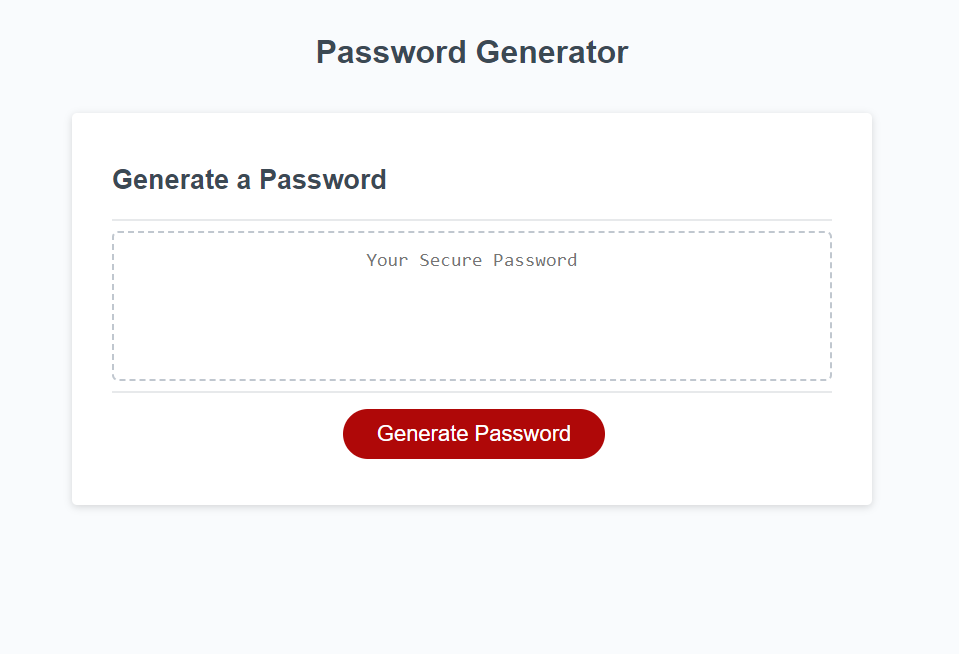

# JavaScript Password Generator

## Activity

- For this activity I created a password generator that will create a password based on criteria chosen by the user using JavaScript.

## User Instructions

- Click the generate password button to start.
- Answer the prompts that pop up to generate your criteria.
- When all prompts have been answered accurately, the password will generate in the text box on the screen based on chosen criteria from the user.

## Screenshot

- Here is a screenshot of the working webpage.

## Working Code

- Here is a link to a working version of my code:
[password-generator](https://laurbaur024.github.io/javascript-password-generator/)